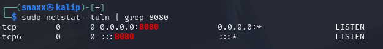
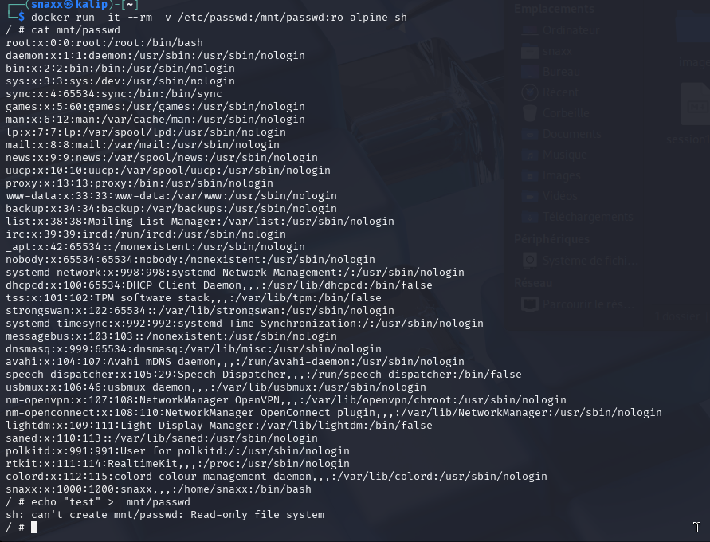
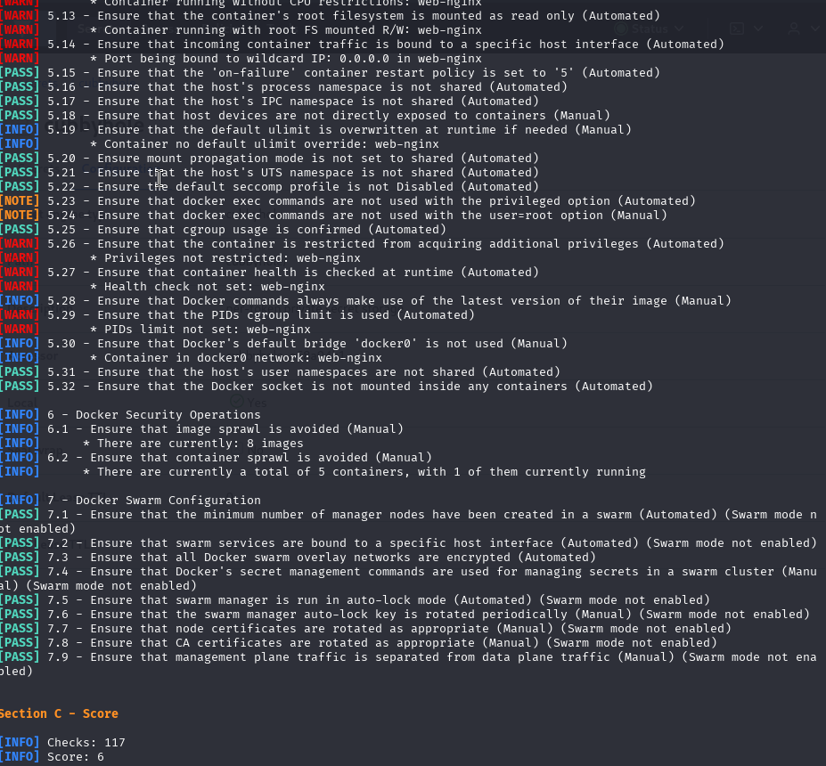

# Session 2 : Bonnes Pratiques de Sécurité des Containers

## Objectifs
- Appliquer les meilleures pratiques pour sécuriser les containers.  
- Comprendre les principes de gestion des droits, des réseaux et des secrets.

---


##  Activités Pratiques

###  Éviter l’Exposition Involontaire de Ports

```bash
docker run -d -p 8080:80 --name web-nginx nginx
```

**Vérification**  
```bash
sudo netstat -tuln | grep 8080
```

  

> On voit bien :`0.0.0.0:8080 LISTEN`, donc le port est exposé.

---

###  Restreindre l’accès aux fichiers sensibles

```bash
docker run -it --rm -v /etc/passwd:/mnt/passwd:ro alpine sh
```

  

> Lecture possible, écriture refusée (`Read-only file system`).

---

###  Auditer avec Docker Bench for Security

```bash
git clone https://github.com/docker/docker-bench-security.git
cd docker-bench-security
./docker-bench-security.sh
```

  

On peut voir ici que mon systeme à un score de 6

Je n'ai pas réussi à auditer le conteneur web/dvwa

---


###  Trouver la clé API dans une image

```bash
docker pull ety92/demo:v1
```

**Étapes d’attaque**  
1. Récupérer l’historique complet des instructions Docker :  
   ```bash
   docker history --no-trunc ety92/demo:v1
   ``` 

2. Filtrer la ligne contenant la requête HTTP :  
   ```bash
   docker history --no-trunc ety92/demo:v1 | grep -i "curl -H"

   ``` 

> La clé trouvée : `U-never-will-saw-that`

**Prévention**  

Une mauvaise pratique est de stocker la clé en dur dans un run (qui est visible dans les layers)

Il faut au contraire passer la clé via une variable d'environnement au démarrage.

---