# Session 1 : Introduction aux Containers et à la Sécurité

## Objectifs
- Comprendre le fonctionnement des containers et leurs différences avec les machines virtuelles.
- Identifier les enjeux de sécurité liés aux containers.

## Activités Pratiques

### Découverte de Docker
- Exécution d'un container test : `docker run --rm hello-world`

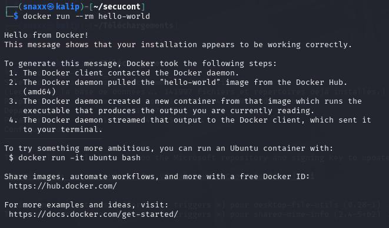
  - Permet de valider le bon fonctionnement de Docker.

### Exploration Interactive
- `docker run -it --rm alpine sh`

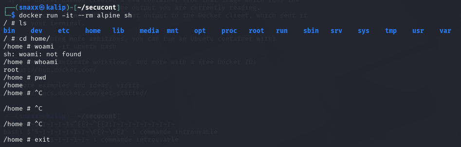
  - Test de commandes classiques comme `ls`,`cd`, `pwd`, `whoami`

### Analyse des Ressources
- `docker run -d --name test-container nginx`
- `docker stats test-container`

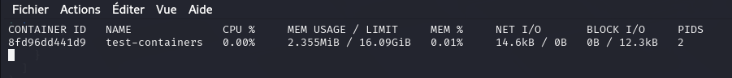
  - Observation de la consommation CPU/Mémoire
  Lors de l’observation des ressources avec docker stats, le container test-containers utilise seulement 2.355 MiB de mémoire (sur 16 Go disponibles) et 0 % de CPU, ce qui montre une consommation très faible, typique d’un container nginx au repos.

### Capacities Linux
- `docker run --rm --cap-add=SYS_ADMIN alpine sh -c 'cat /proc/self/status'`

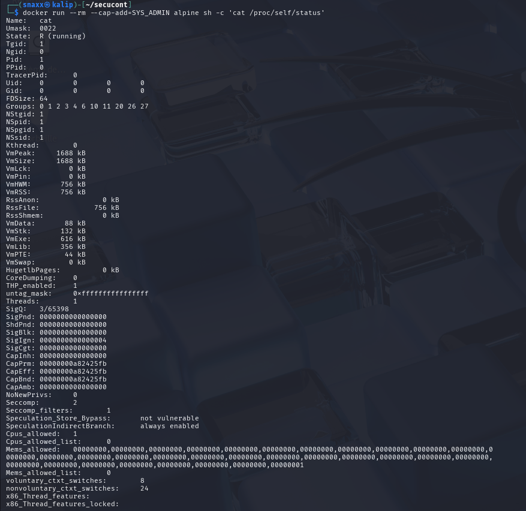
  - Liste des capabilities du container

## Vulnérabilités et Menaces

### Permissions élevées
- `docker run --rm --privileged alpine sh -c 'echo hello from privileged mode'`

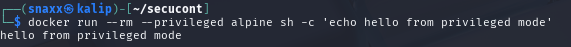
  - Risque d'accès complet au noyau de l'hôte.
  - Démonstration de la mauvaise pratique.

### Évasion de Container
- `docker run --rm -v /:/mnt alpine sh -c 'ls /mnt'`

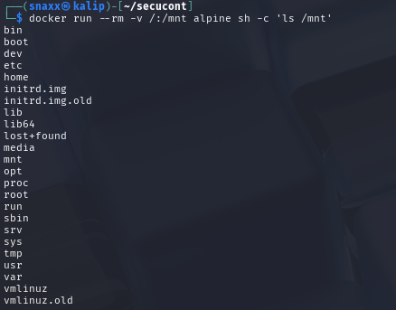
  - Accès au système de fichiers de l'hôte.
  - Exemple d’une mauvaise configuration pouvant être exploitée.

### Image Sécurisée
- Dockerfile minimaliste :

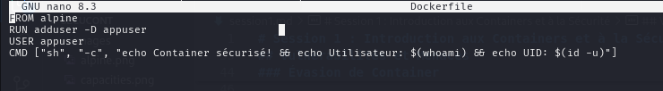
  

- Construction : `docker build -t secure-container .`
- Check : `docker run --rm secure-container `
- UID check : `docker run --rm secure-container id`

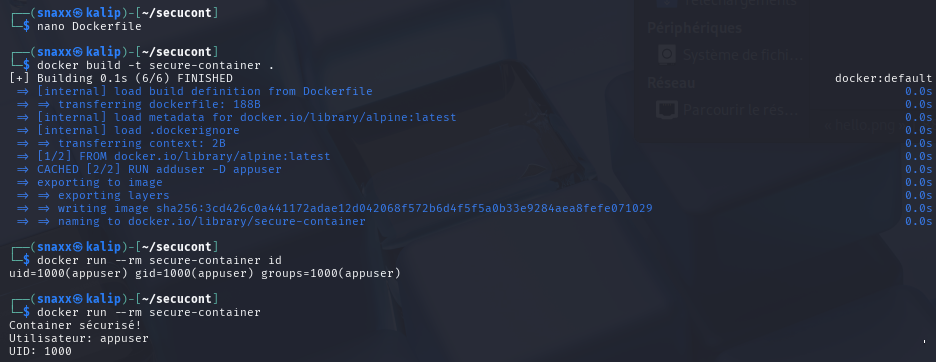

### Réseau

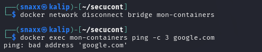
- Déconnexion d’un container du réseau : `docker network disconnect bridge mon-container`
- Test de connectivité : `ping google.com`
- On obtient bien le résultat "ping : bad adress" qui signifie que l'on arrive pas a acceder à google.

## Analyse d’Images

### Trivy
- Image testée : `vulnerables/web-dvwa`

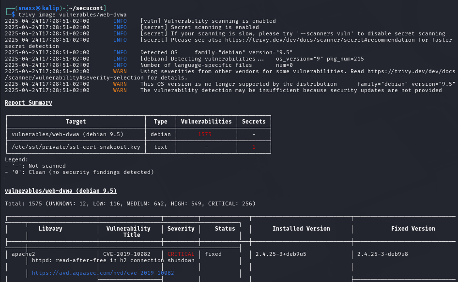
- Le scan de l’image vulnerables/web-dvwa avec Trivy a révélé 1575 vulnérabilités, dont 256 critiques et 549 de haute sévérité, sur une base Debian 9.5 obsolète et non maintenue. De plus, un secret sensible a été détecté dans un fichier de certificat SSL (ssl-cert-snakeoil.key). Cette image est donc hautement vulnérable et illustre parfaitement les risques liés à l’usage d’images publiques non sécurisées.

### Grype
- Images testées : `alpine:latest` & `vulnerables/web-dvwa`

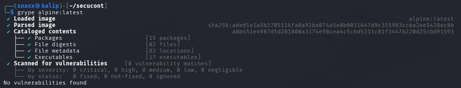

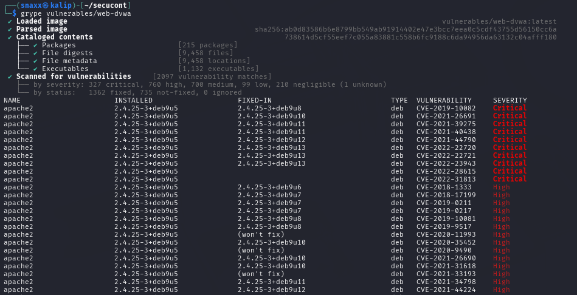
- Aucune vulnérabilité détectées sur alpine
- Différences Trivy/Grype :
  - Trivy intègre les CVE de manière plus visuelle et fournit une vue d'ensemble pratique.
  - Grype est plus détaillé dans la présentation des packages touchés.

## Étude de Cas : Élévation de Privilège

**Mesures de prévention :**
- Ne jamais utiliser `--privileged` sauf cas très spécifique et maitrisé.
- Utiliser des utilisateurs non root.
- Scanner les images régulièrement.
- Appliquer les mises à jour du runtime (ex : `runc`).
- Restreindre les volumes montés à ce qui est strictement nécessaire.

